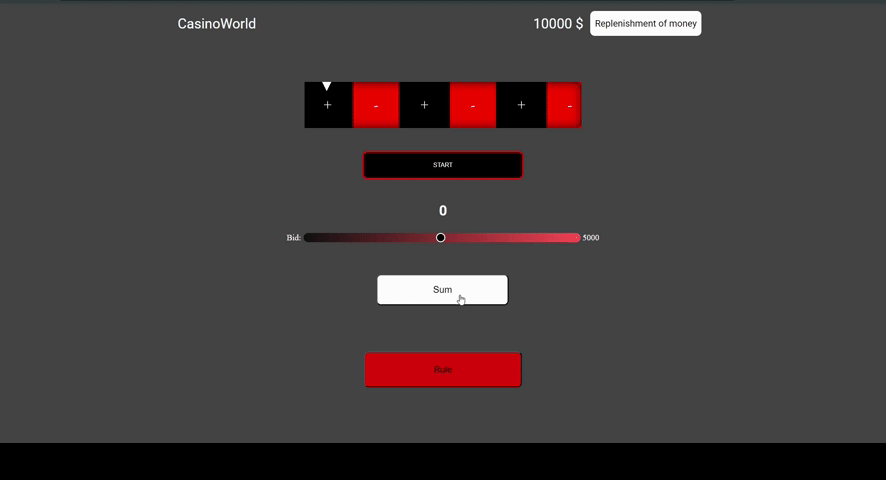

# 🎰 Casino Pet-project

> Hey, player, come to the casino to play,  
> You won't believe your eyes!  
> A cascade of disadvantages awaits you.  
> Ready? Enter the VIP room!

⚠ **Disclaimer:** This project does not involve real money games — it's a pet project made for fun and educational purposes only.

## 🔗 Demo

👉 [View Live Site](https://ramzilasadullinxd.github.io/Casino/)

## 🛠️ Technologies Used

- HTML
- CSS 
- JavaScript (roulette animation, fake balance logic, randomizer, sliders)  

## 🎥 Video material

## 🚀 Features

- 🎡 Roulette animations
- 🎲 Randomizer (win/lose)  
- 📏 Betting slider
- 💰 Fake balance display (persists after reload)  
- 📝 Form to “receive” fake money  
- 📱 Fully responsive layout

## 📁 Installation and launch

If you want to run it locally:

- git clone https://github.com/RamzilAsadullinXd/Casino
- cd Casino
- open index.html in browser

## 👤 Аfter
- Developer: Ramzil Asadullin
- telegram "@AsadullinRamzil"
- Gmail "asadullinramzil0@gmail.com"
